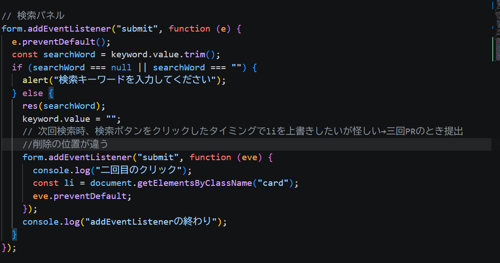

# kadai2_APISearch

岡本の技術課題②公開API記事検索アプリ作成です。

## 調べたこと・詰まった点

### CSS

- flex-box 
  画面サイズを問わず、画面に対しどのあたりに要素を配置するかを指定することができる。 
  display:flexを外側の要素に指定し、中の要素に向きや配置を指定する。
  今回の場合、ユーザーを横に並べたかったためcolmnを指定。

### HTML

- aria-label 
  アクセシビリティのために、要素に名前を付けておくことができる属性のこと。 コードのレビュワーに対し、その要素が何を書いているのかを明示する役割もある。

- aria(エイリア) 
  ~~可読性や、アクセシビリティに対応するために付与するもの。~~ 
  支援技術へ要素の名前・役割・状態を伝えるための仕組み。 
  支援技術→求められたときに使えるようにしておくもの。読み上げ対応など 
  アクセシビリティ→誰にでも使えるようにしておくもの。色や大きさなど 
  前回課題はaria-labelが、今回課題ではaria-liveが登場した。 
  HTMLのタグに付け、スクリーンリーダーで読み上げさせることができる。 
  aria-liveは情報の更新に関するものであり、三つの属性を持つ。 
  ①assertive:ほかの箇所を読み上げている最中でも変更を通知 
  ②polite:読み上げている箇所を読み終わり次第変更を通知 
  ③off:ユーザーが変更箇所に触らない限り通知しない 

- label for 
  aria-label同様に、アクセシビリティ(と可読性)のための要素。 特に、idを軸にしてどの要素が関連づいているのかを示す。 役割は命名のみであるため、labelそのものをjsやCSSで呼び出せるわけではない点には注意が必要である。 
  【追記】関連付けを示すだけではなく、labelをつけておいた文字列などをクリックすれば、指定したidを持つ要素（入力欄など）に移動することができる。

### js

- Promise 
  非同期処理（すぐにはレスポンスの返ってこない処理）が~~成功したか、失敗したかの結果を返す~~オブジェクト。
  **→Promise自体が、成功したか、失敗したか、処理中かの状態を持つ**

- fetch() 
  Promiseを返してくれるメソッド。

- **try-catchと.then.catch** 
  ~~この二つはともに、Promiseの結果にあわせて処理を書き込むためのものである。tryおよびthenは、成功した場合の処理を、catchは呼び出しに失敗した際の処理を書き込み利用する。 tryとthenの大きな違いは、**thenは次のPromiseをすぐに呼び出す**という点である。 今回は、APIを呼び出した後すぐさまjsonも呼び出すのでthenでも問題はない？→仕様書や相談など、感覚をつかむまでは適宜確認する。~~
  **→役割がそもそも違う。**
  - try-catch 
    tryの中に、失敗する可能性のある処理（Promiseなど）を書いておき、失敗した際の処理をcatchに書いておくもの。
    **→try-catchはPromiseなどに限らず、広い使用用途を持つ（配列への処理など）**
  - .then()
    Promiseの返り値がfullfilledだった際に、次に行う処理を書いておくもの。どちらかといえば機能はasync-awaitに近い。
    【疑問】 
    Q,なぜ.then()を使う際は今まで必要だったtryが不要になるのか 
    A,.then()は、前のPromiseの成功が前提にあるため。 
    そもそもawaitは前のPromiseの応答を待つものである。 
    **awaitをつけないと処理が勝手に行われる状態にあるからawaitが必要であり、本来成功失敗を問わず処理してしまうから、例外を監視したい処理範囲であるtryの中に入れている。** 
    先述の通り、.then()はもともと前のPromiseが成功する前提にある。Promiseが失敗すれば、catchに勝手に流れるようになっている。 
    awaitにはtry/catchを、.then()にはcatchをつける処理をそれぞれセットにしておく。

- async-await 
  awaitを利用することで、非同期処理中に、処理が完了していないまま次の処理に進むことを防ぐ（＝awaitを書いた位置で処理が完了するまで、一時停止する）ことができる。 asyncは、awaitを利用するため関数の前に必ず付与する。

- getElementById 
  HTML内で唯一無二の要素（id）を一つだけ拾う呼び出しを行う。

- getElementsByClassName 
  クラス名を拾う呼び出しを行う。 

- document.querySelector("") 
  " " 内に指定した要素の一つ目を拾ってくる。 
  クラス名、id、要素名など柔軟に指定することができる。

- document.querySelectorAll("") 
  " " 内に指定した要素をすべて拾ってくる。 
  idはページ内で一意である必要があるため、querySelectorAllは利用できない（意味がない）。

- **querySelectorとgetElementの違い**
  getElementはライブコレクションという性質を持つ。 
  **（getElementByClassNameのみ。idは一意なので変化の仕様がなく、静的である）** 
  これにより、querySelectorはquerySelectorを**記述した時点で指定した内容を呼びだす**が、 
  getElementは、~~指定した内容が更新されれば、更新された値を、常に中に持つ~~**指定したクラスに要素が追加されれば、追加した値も含めて呼び出すことができる**という違いがある。

- addEventListernerの行われるタイミング（重複して使えない） 
   
  当初、画像のようにaddEventListernerの中にaddEventListernerを混入させようとしていた。 
  ~~例えば、async・awaitを利用した非同期処理や、わざと秒数を待って処理を行うものを作れば不可能ではないが、特殊な事例である。というのも、今回の例でいえばsubmitされた瞬間にすべての処理は走っており、画像の記述方法であれば「submitを押されたのと同時に二回目のsubmitが行われたら」という、不可能な発火条件となっている。~~ 
  今回でいえば、一度目のsubmit時には、二つ目のsubmitリスナー登録のみ行われる。その後、二回、三回と繰り返すうちに、そのたびリスナーが追加され、前回までに追加されたリスナーがすべて発火し…。という状況になる。

- **resetの位置** 
  検索結果を毎回更新するためには、前回の呼び出し結果の表示を削除する、もしくは上書きする必要がある。 
  それゆえ、呼び出し結果が作られている状態から削除を適用する方法に苦戦した。 
  最終的に、考え方をご質問し、呼び出し結果が作られていない状況でも削除を適用するよう設計した。 

- 配列から「,」を抜く方法 
  今回のように配列を文字列として扱いたい場合、.join()を使って配列を結合することができる。 
  しかしその際、配列の要素間にある「,」も一緒に結合されてしまう。 
  対策として、.join("")として空文字を挿入することで、カンマのない文字列として取得する方法がある。

- .map() 
  配列にアプローチして、元の配列は変えないまま新しい配列を生み出す。 
  .map()は引数に関数を入れることで、要素に関数をあてたものを配列として取得することができる。 
  前回課題でも使用した.slice()は、引数内で指定したインデックスの分だけ配列内の要素を抽出し、新たな配列を作成するメソッドである。 
- res.ok 
  APIからのレスポンスが成功したかを確認するために利用する。 
  戻り値はtrueかfalseであり、if文と併用することで、レスポンス成功時の処理と失敗時の処理を切り分けることができる。

- throw Error 
  res.okがfalseだった時の処理に今回は利用している。強制的にエラーを出し、try-catchのcatchに飛ばすことができる。 
  中に表記する文字に厳しいルールはないが、エラーの分析に利用するため、見てすぐに意味が理解できるものを記述すべきである。 

- URLの組み立て 
  PR2の第一回PR時点では、ユーザーの入力した内容がそのままクエリに直打ちされていた。これは、**ユーザーの利用時のバグの誘発や、悪意ある入力を受け付けかねない。** 
  →そのために、文字列をクエリパラメーターとして正しくエンコードする 
  対策には、URL()というコンストラクターがある。用途の幅が非常に広いので、今回は実際に記述したものにコメントを付与する。 
  // クエリを加えない素のURLを変数に格納
  const url = new URL("https://qiita.com/api/v2/items"); 
  // .searchでURL内の？以降を指定。 
  // 入力された文字を、検索用に16進数と記号で表示するURLSearchParamsで変換 
  url.search = new URLSearchParams({ 
  query: keyword, 
  page: "1", 
  per_page: "20", 
  }); 
  // 確認用　console.log("URL組み立て成功"); 
  // fetchするのは、先ほど設定した変数urlでよい。
  const response = await fetch(url); 
  - ステータス変更のやり方 
    今回のように、状態が変更される処理を扱う際、一つの関数の中にまとめて処理を書き込み、 
    if文の分岐で分けて処理することができる。 
    検索中か、それ以外かで大きなくくりを作ったうえで、検索中でないならば、結果が出ているのか、 
    それともエラーが出たのかなど、引数とともに切り分け処理を用意しておく。 
    そのうえで、各処理を行う際に、用意しておいた引数を入れて関数を呼び出し、処理を実現させる。 

- try-catch-finally 
  成功するかわからない処理をtryの中に、失敗した場合の処理をcatchに記述しておく。 
  finallyには、try内の処理が成功して終了したとしても、失敗してcatchに入ったとしても共通して行う処理を記述しておく。

- resetの位置
  前回まで、resetを一通りの検索・表示処理が終了した後に配置していた。この場合、前回の検索結果やキーワードを入力欄に残したまま検索を行うという不便さが生じてしまう。

- .status
  responseにつけた変数名に.statusを付与し、HTTPエラーと合わせて使用することで、発生したエラーの番号を内容を取得することができる。

### その他

- figma使い方
  CSS要素をクリップボードにコピーできることを学び、大幅に開発効率が上昇した
